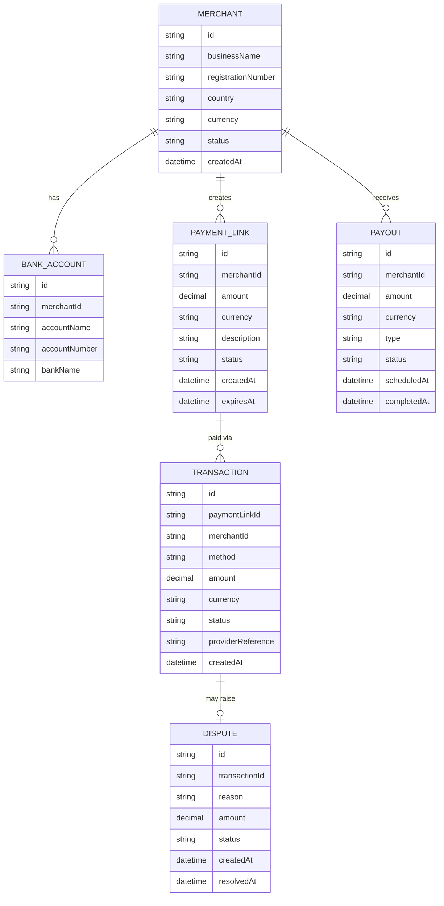

# Domain Model

The core entities behind merchant onboarding, payment collection, and payouts.

- A `MERCHANT` starts `pending` review and moves to `approved`, `rejected` or `suspended`.
- A `PAYMENT_LINK` is `open`, `paid` or `expired`; a `TRANSACTION` records one payment attempt against it (`mobile_money` or `card`), moving through `pending`, `completed`, `failed`, or `disputed`.
- A `PAYOUT` is either `automatic` (daily schedule) or `manual` (on-demand request), moving through `pending`, `completed`, `failed`.
- A `DISPUTE` tracks a chargeback raised against a `TRANSACTION`, debiting the merchant's balance immediately and reversing it if resolved in the merchant's favor.

