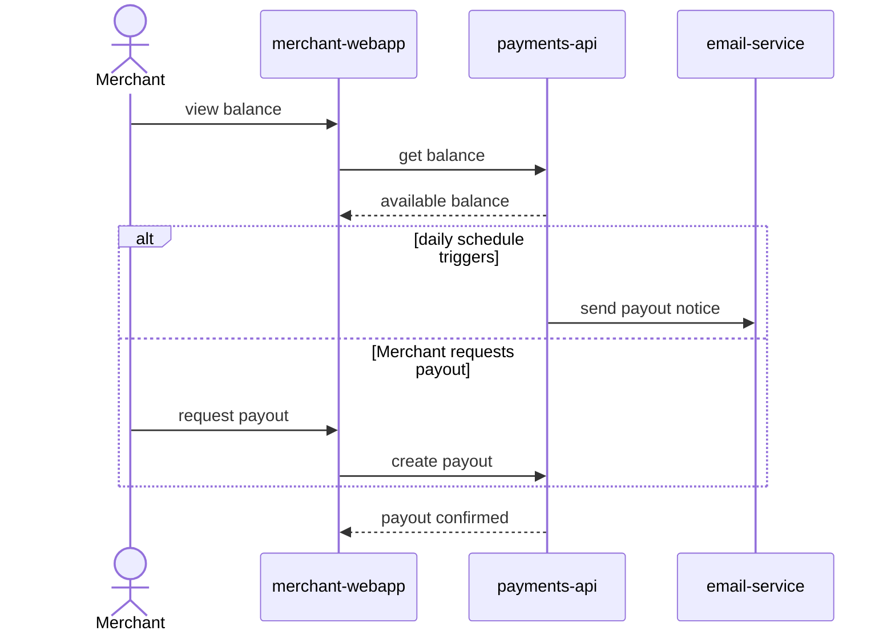

# Payout

A Merchant's collected funds settle to their bank account either automatically on a daily schedule or on demand.

```mermaid
sequenceDiagram
    actor Merchant
    participant merchant-webapp
    participant payments-api
    participant email-service

    Merchant->>merchant-webapp: view balance
    merchant-webapp->>payments-api: get balance
    payments-api-->>merchant-webapp: available balance
    alt daily schedule triggers
        payments-api->>email-service: send payout notice
    else Merchant requests payout
        Merchant->>merchant-webapp: request payout
        merchant-webapp->>payments-api: create payout
    end
    payments-api-->>merchant-webapp: payout confirmed
```

