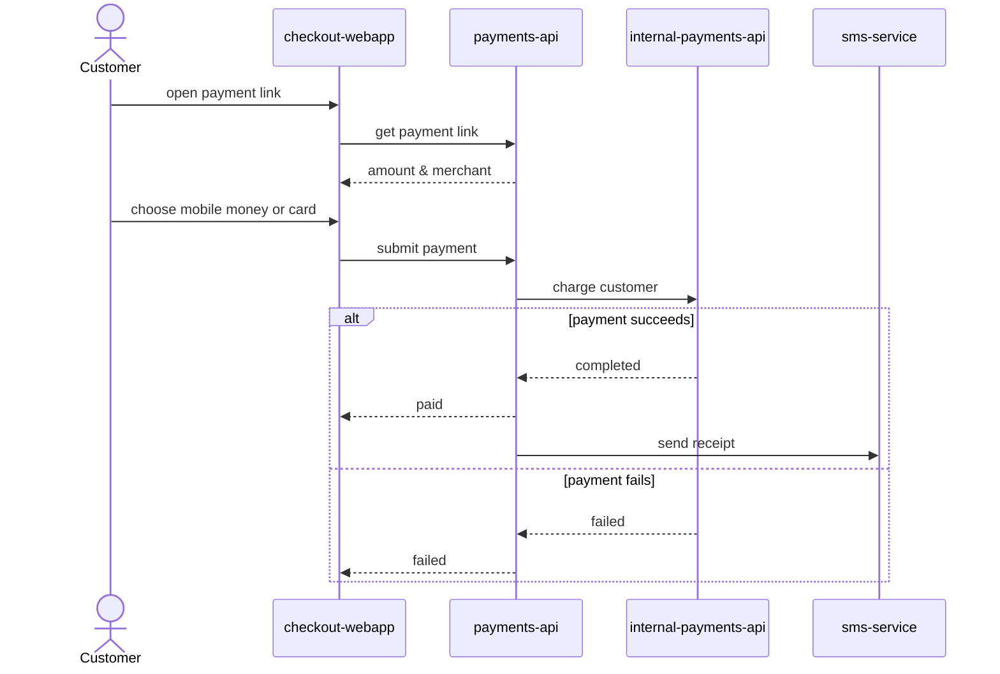

# Customer Payment

A Customer opens a merchant's payment link and pays via mobile money or card on the hosted checkout page.

```mermaid
sequenceDiagram
    actor Customer
    participant checkout-webapp
    participant payments-api
    participant internal-payments-api
    participant sms-service

    Customer->>checkout-webapp: open payment link
    checkout-webapp->>payments-api: get payment link
    payments-api-->>checkout-webapp: amount & merchant
    Customer->>checkout-webapp: choose mobile money or card
    checkout-webapp->>payments-api: submit payment
    payments-api->>internal-payments-api: charge customer
    alt payment succeeds
        internal-payments-api-->>payments-api: completed
        payments-api-->>checkout-webapp: paid
        payments-api->>sms-service: send receipt
    else payment fails
        internal-payments-api-->>payments-api: failed
        payments-api-->>checkout-webapp: failed
    end
```

