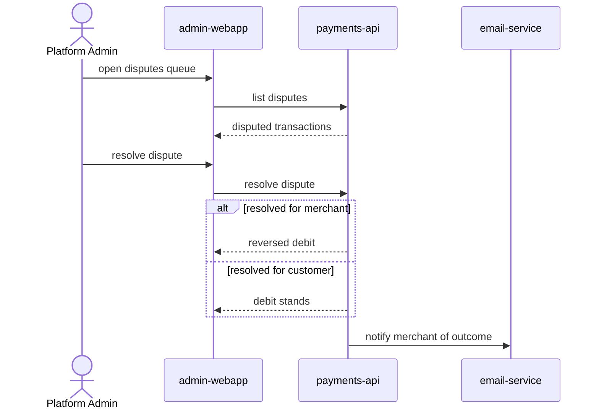

# Dispute Resolution

A Platform Admin reviews a disputed transaction and resolves it in favor of the merchant or the customer.

```mermaid
sequenceDiagram
    actor Admin as Platform Admin
    participant admin-webapp
    participant payments-api
    participant email-service

    Admin->>admin-webapp: open disputes queue
    admin-webapp->>payments-api: list disputes
    payments-api-->>admin-webapp: disputed transactions
    Admin->>admin-webapp: resolve dispute
    admin-webapp->>payments-api: resolve dispute
    alt resolved for merchant
        payments-api-->>admin-webapp: reversed debit
    else resolved for customer
        payments-api-->>admin-webapp: debit stands
    end
    payments-api->>email-service: notify merchant of outcome
```

