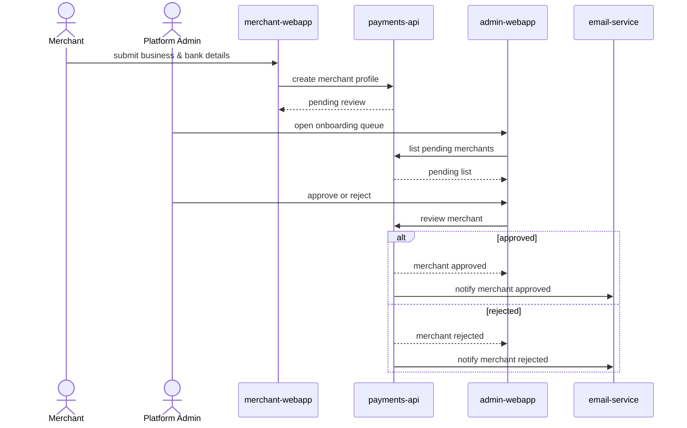

# Merchant Onboarding

A Merchant submits business details for review; a Platform Admin approves or rejects the submission before the merchant can accept live payments.

```mermaid
sequenceDiagram
    actor Merchant
    actor Admin as Platform Admin
    participant merchant-webapp
    participant payments-api
    participant admin-webapp
    participant email-service

    Merchant->>merchant-webapp: submit business & bank details
    merchant-webapp->>payments-api: create merchant profile
    payments-api-->>merchant-webapp: pending review
    Admin->>admin-webapp: open onboarding queue
    admin-webapp->>payments-api: list pending merchants
    payments-api-->>admin-webapp: pending list
    Admin->>admin-webapp: approve or reject
    admin-webapp->>payments-api: review merchant
    alt approved
        payments-api-->>admin-webapp: merchant approved
        payments-api->>email-service: notify merchant approved
    else rejected
        payments-api-->>admin-webapp: merchant rejected
        payments-api->>email-service: notify merchant rejected
    end
```

